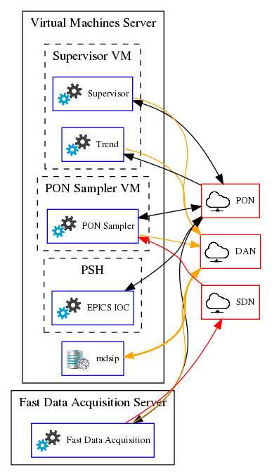

# Falcon Data Storage and Supervision

This project contains all the files related to the management of the Falcon data storage and supervision system. 

## Functions

The main functions of the Falcon data acquisition system are:

* \[F1\] Define and manage the concept of an experiment, so that a new MDSplus pulse number is created everytime an experiment is executed;
* \[F2\] Define and manage an MDSplus database model to store the control system configuration against a given pulse number;
* \[F3\] Define and manage an MDSplus database model to store the plant signals acquired by the control system; 
* \[F3.1\] Some signals are to be continuosly stored, everytime the signal changes and irrespectively of the pulse number;	 
* \[F3.2\] Some signals are to be stored and associated against a given pulse number of an experiment;
* \[F3.2.1\] Some signals are to be stored at a rate of less than 1 kHz;
* \[F3.2.2\] Some signals are to be stored at a rate greater or equal to 1 kHz; 
* \[F4\] Allow to configure the control system with the configuration parameters that were used in a previous experiment. 

These functions are implemented in the following subsystems:

* \[F3.2.1\] in the [PON Sampler](https://vcis-gitlab.f4e.europa.eu/aneto/PON-Sampler-Falcon);
* \[F3.2.2\] in the [Fast Data Acquisition](https://vcis-gitlab.f4e.europa.eu/aneto/PON-Sampler-Falcon);
* \[F1\], \[F2\] and \[F4\] in the Supervisor service of the Data Storage System (described in this document); 
* \[F3.1\] in the Trend service of the Data Storage System (described in this document);

## Networks

The following data acquisition networks are deployed in the Falcon plant:
* PON: for the configuration and monitoring of the control system. The traffic is EPICS ChannelAccess;
* DAN: for storage of plant configuration and signals in the MDSplus database. The traffic is MDSplus *mdsip*;
* SDN: to provide the time synchronisation between the PON Sampler and the Fast Data Acquisition subsystems. The traffic is multicast UDP. 

## Data Storage System Architecture

The Data Storage System provides the Supervisor and the Trend archiver java based services. 



The following MDSplus trees are defined: 

| Tree | Description |
| ---| ----- |
| falcon | Master tree |
| falcon_conf | Subtree of falcon. Stores the control system configuration of a given experiment. |
| falcon_mon | Subtree of falcon. Stores the control system signals of a given experiment. |
| falcon_fast | Subtree of falcon. Stores the control system fast data acquisition signals of a given experiment. |
| falcon_trend | Stores the control system monitoring signals. |

### Supervisor

The Supervisor is a java program named [EpicsDispatcher](https://vcis-gitlab.f4e.europa.eu/aneto/Data-Storage-Falcon/blob/master/Tools/EpicsDispatcher.java). 

It allows to associate the execution of a command line action against the change of an EPICS PV. The configuration of the Supervisor is defined by this [configuration file](https://vcis-gitlab.f4e.europa.eu/aneto/Data-Storage-Falcon/blob/master/Configurations/FalconPulseSupervisor.json).

| PV | Value | Action | Comments |
| ---| ----- | ------ | -------- |
| FALCON:PULSE:START | 0 | Executes [StopFalconPulse.sh](https://vcis-gitlab.f4e.europa.eu/aneto/Data-Storage-Falcon/blob/master/Tools/StopFalconPulse.sh) | Changes the PON Sampler and the Fast Data Acquisition systems into IDLE (so that data is no longer stored in MDSplus). | 
| FALCON:PULSE:START | 1 | Executes [StartFalconPulse.sh](https://vcis-gitlab.f4e.europa.eu/aneto/Data-Storage-Falcon/blob/master/Tools/StopFalconPulse.sh) | 1. Creates a new MDSplus pulse number by executing [CreateFalconPulse.tcl](https://vcis-gitlab.f4e.europa.eu/aneto/Data-Storage-Falcon/blob/master/Tools/CreateFalconPulse.tcl); <br/> 2. Stores the current control system configuration into the MDSplus configuration tree by executing the [SaveEpicsSnapshotInMds](https://vcis-gitlab.f4e.europa.eu/aneto/Data-Storage-Falcon/blob/master/Tools/SaveEpicsSnapshotInMds.java) java program; <br/> 3. Changes the PON Sampler and the Fast Data Acquisition systems into RUNNING (so that data is stored in MDSplus). |
| FALCON:PULSE:LOAD_CMD | 1 | Executes [LoadFalconPulse.sh](https://vcis-gitlab.f4e.europa.eu/aneto/Data-Storage-Falcon/blob/master/Tools/LoadFalconPulse.sh) | Executes the [LoadEpicsSnapshotFromMds](https://vcis-gitlab.f4e.europa.eu/aneto/Data-Storage-Falcon/blob/master/Tools/LoadEpicsSnapshotFromMds.java) java program in order to load the control system configuration variables with the falcon_conf tree values that were stored for the pulse number defined in the PV variable FALCON:PULSE:LOAD. |

 **Note that before loading the configuration of a given experiment** (by changing the value of FALCON:PULSE:LOAD_CMD from 0 to 1) the value of the pulse number to load must have been previously set in the variable FALCON:PULSE:LOAD.
 
### Trend
 
The Trend is a java program named [ChannelArchiver](https://vcis-gitlab.f4e.europa.eu/aneto/Data-Storage-Falcon/blob/master/Tools/ChannelArchiver.java).
 
It listens to all the PV variables defined in the *falcon_trend* tree and stores a new value everytime any of the PV values changes. 
 
## Installation
 
### MDSplus

This procedure is to be performed in the server that will host the database.

#### Procedure
 
1. Install the [MDSplus alpha database](http://www.mdsplus.org/index.php/Latest_RPM%27s_and_Yum_repositories) as a xinetd service (this is performed by following instructions provided in the [MDSplus wiki](http://www.mdsplus.org/index.php/Documentation:Tutorial:RemoteAccess)).
2. Install the mdsplus-alpha libraries
 
```
yum install mdsplus-alpha
yum install mdsplus-alpha-kernel
yum install mdsplus-alpha-java
```
 
3. Edit the file /etc/mdsplus.conf and write:
 
```
falcon_path /raiddata/mdsplus/trees
falcon_conf_path /raiddata/mdsplus/trees
falcon_mon_path /raiddata/mdsplus/trees
falcon_fast_path /raiddata/mdsplus/trees
falcon_trend_path /raiddata/mdsplus/trees
```
4. Retrieve the Data-Storage-Falcon project (this procedure can be performed in any PC that has access to the DAN network)
 
```
cd ~ 
mkdir Projects
cd ~Projects
git clone https://aneto@vcis-gitlab.f4e.europa.eu/aneto/Data-Storage-Falcon.git  
```

**Note** Replace aneto with your username.
  
5. Build the tools

```
cd ~/Projects/Data-Storage-Falcon/Tools/
make
```
  
6. Create the trees:
  
   1. Copy the xml file exported from SDD into *Data-Storage-Falcon/Configurations/SDD_falcon.xml*. **Note the following rules**:
       * All the variables whose name end with *_Act* will be added into the *falcon_conf* tree;
       * All the variables will be added into the *falcon_trend* tree;
       * All the variables whose names ends with any of the following keys *{"-RDI", "-XS", "-XI0", "-XI", "-IN", "-RDO", "-IN", "-YT", "-XA", "-XA0", "-XA", "-XA01", "-XA02", "-XA1", "-XA2"}* will be added into the *falcon_mon* tree;       
 
```
cd ~/Projects/Data-Storage-Falcon/Tools/
xsltproc sdd2VariablesList.xsl ../Configurations/SDD_falcon.xml > ../Configurations/SDD_falcon_var.xml
export TREE_LOCATION=10.136.30.21:8000::/raiddata/mdsplus/trees
cd ~/Projects/Data-Storage-Falcon/Tools/
make trees
```
  
### Supervisor and Trend
#### Procedure
 
1. Log-in as *codac-dev* to the Supervisor VM (10.136.50.22).
2. Install the [MDSplus alpha version](http://www.mdsplus.org/index.php/Latest_RPM%27s_and_Yum_repositories)
3. Install the mdsplus-alpha libraries
 
```
yum install mdsplus-alpha
yum install mdsplus-alpha-devel
yum install mdsplus-alpha-java
yum install mdsplus-alpha-kernel
yum install mdsplus-alpha-python
```
 
4. Edit the file /etc/mdsplus.conf and write:

```
falcon_path 10.136.30.21:8000::/raiddata/mdsplus/trees
falcon_conf_path 10.136.30.21:8000::/raiddata/mdsplus/trees
falcon_mon_path 10.136.30.21:8000::/raiddata/mdsplus/trees
falcon_fast_path 10.136.30.21:8000::/raiddata/mdsplus/trees
falcon_trend_path 10.136.30.21:8000::/raiddata/mdsplus/trees
```

5. Retrieve the Data-Storage-Falcon project
  
```
cd ~
mkdir Projects
cd ~Projects
git clone https://aneto@vcis-gitlab.f4e.europa.eu/aneto/Data-Storage-Falcon.git  
```
**Note** Replace aneto with your username.
  
6. Build the tools

```
cd ~/Projects/Data-Storage-Falcon/Tools/
make
```
 
7. Edit the inittab file and change *id:5:initdefault:* to *id:3:initdefault:* 
 
```
su
vim /etc/inittab
exit
```

8. Disable unused services

```
su
setup
```

Disable the following services:

* bluetooth
* ip6tables
* iptables
* postgresql-9.3
* CTRL-*
* MAG-*
* TEST-*
* sup-*
* css-*

```
OK->Quit
```


9. Create the service

```
su
ln -s /home/codac-dev/Projects/Data-Storage-Falcon/Startup/FalconSupervisor /etc/init.d/
ln -s /home/codac-dev/Projects/Data-Storage-Falcon/Startup/FalconTrend /etc/init.d/
/sbin/chkconfig --level 3 FalconSupervisor on
/sbin/chkconfig --level 5 FalconSupervisor on
/sbin/chkconfig --level 3 FalconTrend on
/sbin/chkconfig --level 5 FalconTrend on
/etc/init.d/FalconSupervisor restart
/etc/init.d/FalconTrend restart
exit 
```
 
9. Restart the Trend service daily 
 
```
su
crontab -e
0 2 * * * /etc/init.d/FalconTrend restart
exit
exit
```

## Current deployment
 
| Server             | IP            | Service                                 | Restart command | Log |
| ------             | ---           | ------                                  | ------- | --- |
| Falcon Server      | 10.136.30.21  | mdsip/xinetd (MDSplus database service) |  | |
| Falcon Server      | 10.136.50.23  | ssh |  | /var/log/messages |
| SupervisorVM       | 10.136.50.22  | ssh | | /var/log/messages |
| SupervisorVM       | 10.136.100.28 | Supervisor | /etc/init.d/FalconSupervisor restart | /var/log/falconsupervisor | 
| SupervisorVM       | 10.136.100.28 | Trend | /etc/init.d/FalconTrend restart | /var/log/falcontrend | 
 
## Troubleshooting

TODO